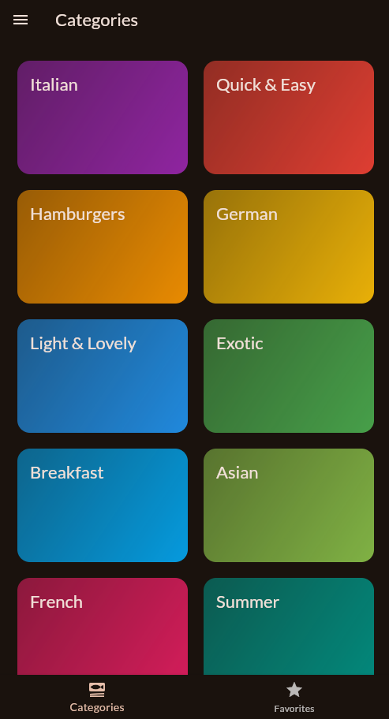
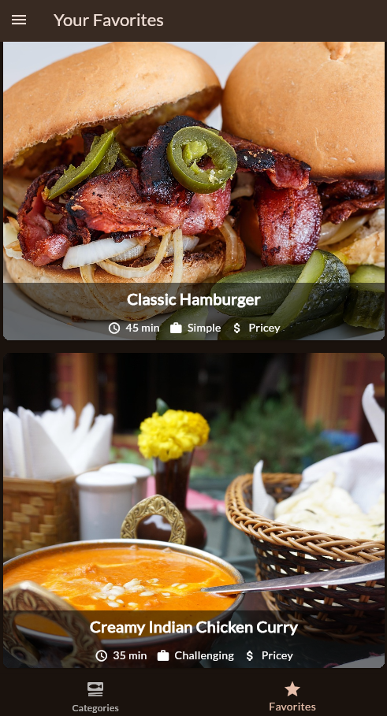
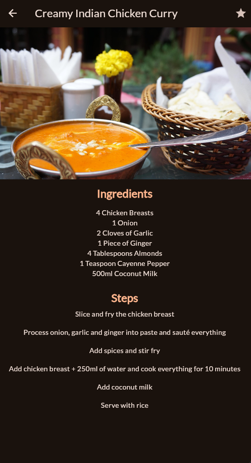
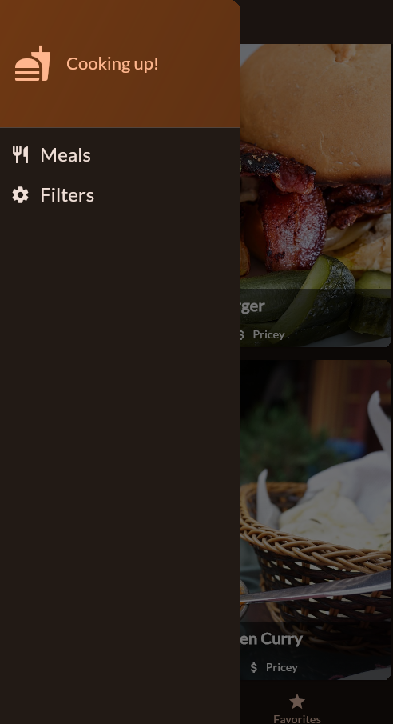
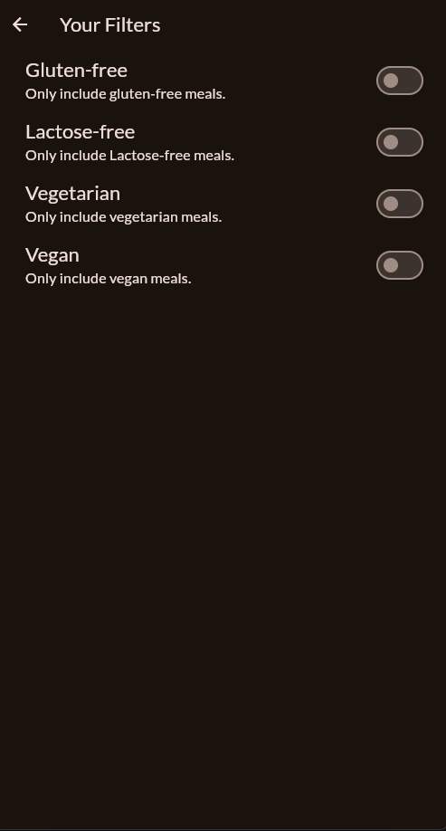

# 🍽️ Meals App

A simple and clean Flutter application that helps you explore meal categories, browse meals, view detailed information, mark your favorites, and apply dietary filters.

## 📱 Features

- ✅ Displays a list of **meal categories**
- ✅ Shows a list of meals under each category
- ✅ View **detailed information** for each meal
- ✅ Mark meals as **favorites**
- ✅ Apply **filters** (e.g., gluten-free, vegetarian, vegan, lactose-free)

## 🛠️ Tech Stack

- **Flutter**
- **Dart**

## 📸 Screenshots

## 📸 Screenshots

<div align="center">


<br/>
<i>List of meal categories</i>
<br/><br/>


<br/>
<i>Your favorite meals</i>
<br/><br/>


<br/>
<i>Detailed view of a selected meal</i>
<br/><br/>


<br/>
<i>Navigation drawer of the Meals App</i>
<br/><br/>


<br/>
<i>Apply filters like vegetarian, vegan, gluten-free</i>
</div>


## 🚀 Getting Started

### Prerequisites

- Flutter SDK installed ([Install Flutter](https://flutter.dev/docs/get-started/install))
- A code editor like VS Code or Android Studio

### Installation

1. **Clone the repo**
   ```bash
   
   git clone https://github.com/barathan76/meals.git
   cd meals
